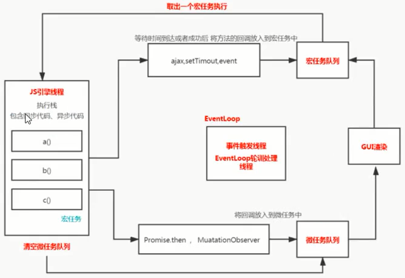

# EventLoop
>js是单线程（主线程）的

## 1 关于浏览器的进程
- 一个页卡就是一个进程
    - 渲染进程 ：页卡包括一个渲染进程，用于渲染页面
        - gui线程（与js线程互斥）
        - js线程（与ui线程互斥）
        - 事件触发线程（eventLoop）
        - ...
    - ...
## 2 eventLoop的作用
轮询处理线程，管理js调用的异步方法
1. js引擎执行脚本，过程中将宏任务和微任务分别放入对应的队列
2. 清空微任务队列
3. GUI可能渲染可能不渲染，GUI渲染间隔大约是16ms
4. 会看看有没有要执行的宏任务，如果有就取出一个宏任务放入js引擎中执行，执行过程中又将产生的宏任务和微任务分别放入对应的队列，跳到第2步
- 宏任务：script脚本  界面渲染 setTimeout setInterval postMessage MessageChannel setImmediate  事件 ajax
- 微任务： promise mutationObserver 
