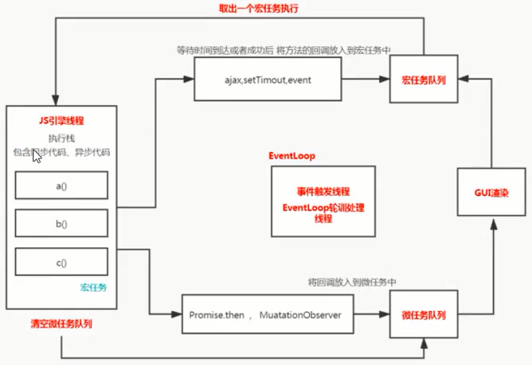

## EventLoop

> js 是单线程（主线程）的

### 1 关于浏览器的进程

- 一个页卡就是一个进程，它包括：
  - 渲染进程 ：用于渲染页面
    - gui 线程（与 js 线程互斥）
    - js 线程（与 ui 线程互斥）
    - 事件触发线程（eventLoop）
    - ...
  - ...

### 2 eventLoop 的作用

轮询处理线程，管理 `js` 调用的异步方法

1. `js` 引擎执行脚本，过程中将宏任务和微任务分别放入对应的队列
2. 清空微任务队列
3. `GUI` 可能渲染可能不渲染，`GUI` 渲染间隔大约是 `16ms`
4. 会看看有没有要执行的宏任务，如果有就取出一个宏任务放入 `js` 引擎中执行，执行过程中又将产生的宏任务和微任务分别放入对应的队列，跳到第 `2` 步

- 宏任务：`script脚本` 界面渲染 `setTimeout` `setInterval` `postMessage` `MessageChannel` `setImmediate` `event` `ajax`
- 微任务： `promise` `mutationObserver` `queueMicrotask`
  

## 什么是闭包

在一个作用域里面包含一个函数，这个函数可以调用作用域里的变量

## 变量提升

- 编译阶段时，会将使用`function`的函数声明式赋值给`VO`，再将`var`声明的变量声明在`VO`(值是`undefined`)
- 在浏览器运行环境中（`node`中的`global`不会这样），ES6 中`var`、`function`声明的全局变量，依然是顶层对象`window`的属性（在`VO`和`GO`上都设置）；`let、const、class` 声明的全局变量不属于顶层对象的属性（只在`VO`上设置变量）
- `return`后面的部分不会变量提升，如：

```js
Function.prototype.bind = function (context, ...args1) {
  const fn = this;
  bindFn.prototype = this.prototype; //报错bindFn is not defined
  return function bindFn(...args2) {
    if (this instanceof bindFn) {
      context = this;
    }
    fn.call(context, ...args1, ...args2);
  };
};
```

```js
console.log(a); //[Function: a]
var a = 1;
function a() {}
console.log(a); //1
```

`var` 不像 `let` ，`var`没有块的概念，所以虽然用`{}`包起来但还是会提升
```js
console.log(a); //undefined
if (true) {
  var a = 1;
}
```

虽然里面的代码没有执行，但是变量提升是在编译阶段而不是执行阶段
```js
console.log(a); //undefined
if (false) {
  var a = 1;
}
```

```js
console.log(index); //undefined
console.log(a); //undefined
for (var index = 0; index < 5; index++) {
  var a = 1;
}
```

这个比较奇怪，目前还不知道怎么解释
```js
console.log(fn); //undefined
if (true) {
  console.log(fn); //[Function: fn]
  function fn() {}
}
```

## 关于执行上下文的知识

### 作用域链和调用栈的确定

- 作用域链是在函数**声明**时创建的
- 调用栈是在函数**调用**时创建的

### 执行上下文栈和作用域链

1. 函数运行时，会创建一个执行环境，这个执行环境就叫执行上下文
2. 执行上下文中会创建一个对象叫作变量对象`(Value Object)`,基础数据类型都保存在变量对象中，引用数据类型的值保存在堆里，在变量对象中保存着对应的引用地址
3. 执行上下文栈就是存放所有的执行上下文，他是一个栈形结构，编译阶段时会为每个函数保留一个`scope`属性，保存所有的父变量对象，在函数执行的时候会把自身上下文中的`AO`对象加进去，在函数执行的时候先找自己的`AO`对象，找不到就会通过作用域链一直向上查找

### VO、GO、AO 是什么

- VO：执行上下文中会创建一个对象叫作变量对象`(Value Object)`
- GO：全局变量对象`(Global Object)`
- AO：栈顶的执行上下文中的变量对象`(Active Object)`，里面会生成一个`this`指针

## var、let 的区别

- `var`定义的变量没有块的概念,可以跨块访问,不能跨函数访问,有变量提升,可重复声明
- `let`定义的变量，只能在块作用域里访问，不能跨块访问，也不能跨函数访问，无变量提升，不可以重复声明

```js
{
  let a = 10;
  {
    //1
    console.log(a); //ReferenceError: Cannot access 'a' before initialization
    //2
    let a = 20;
  }
}
```

> 从 1 到 2 的区域被称为暂时性死区

```js
{
  {
    console.log(a);
    let a = 20;
    let a = 10; //SyntaxError: Identifier 'a' has already been declared
  }
}
```

## this的确定

- 未指定情况：非严格模式下是`window/global`，严格模式下是`undefined`
- 事件绑定：指向元素
- 其他：谁调这个方法就是谁

## 浅拷贝和深拷贝的区别以及实现

### 浅拷贝

对新对象中的`非引用类型`的数据进行修改不会影响原对象，但对新对象中的`引用类型`的数据进行修改，会造成对原对象进行修改。如`...运算符`、 `Object.assign()`

### 深拷贝

对新对象的数据修改不会影响到原对象。如 `JSON.parse(JSON.stringify(object))`

- 实现一个深拷贝方法

```js
//判断类型的方法 typeof instanceof Object.toString.call constructor

function deepClone(obj, weakMap = new WeakMap()) {
  //weakMap用来防止环状的对象出现死循环

  //null|undefined
  if (obj == null) return obj;

  //是基础值直接返回
  if (typeof obj !== "object") return obj;

  if (obj instanceof Date) return new Date(obj);
  if (obj instanceof RegExp) return new Regexp(obj);

  if (weakMap.has(obj)) return weakMap.get(obj); //检查缓存
  
  const newObj = new obj.constructor();
  
  weakMap.set(obj, newObj); //设置缓存

  for (const key in obj) {
    if (!obj.hasOwnProperty(key)) continue;
    newObj[key] = deepClone(obj[key], weakMap);
  }

  return newObj;
}

const a = { b: {}, c: 1 };
a.d = a;
console.log(deepClone(a));
```

## 高阶函数

概念：一个函数`返回`一个函数 或者 一个函数`接收`一个函数

### 扩展方法

在函数执行前执行另一个函数

```js
function foo(...args) {
  // 核心代码
  // ....
  console.log("core", args);
  // ....
}
Function.prototype.before = function (cb) {
  // this = foo
  return (...args) => {
    // newFoo
    cb();
    this(...args);
  };
};
let newFoo = foo.before(() => {
  console.log("before");
});
newFoo("a", "b");
```

### 函数柯里化

柯里化可以让函数变得更具体一些，而反柯里化可以让函数范围变的更大一些

#### `fn()()()`形式的柯里化

```js
const crying = (fn) => {
  // usage: newFoo = crying(foo) newFoo()()()
  const inner = (args = []) =>
    fn.length <= args.length
      ? fn(...args)
      : (...newArgs) => inner([...args, ...newArgs]); // 递归返回函数
  return inner();
};
```

#### `fn(); fn(); fn();`形式的柯里化

```js
const crying2 = (fn) => {
  // usage: newFoo = crying(foo) newFoo() newFoo() newFoo()
  let allArgs = [];
  return function inner(...args) {
    allArgs = [...allArgs, ...args];
    if (allArgs.length >= fn.length) {
      fn(...allArgs);
    }
  };
};
```

#### 应用场景：封装类型检测函数

```js
//todo 应用场景1  封装类型检测函数
const isType = (type, val) =>
  Object.prototype.toString.call(val) === `[object ${type}]`;
const utils = {};
[
  "String",
  "Number",
  "Object",
  "Null",
  "Undefined",
  "Function",
  "Symbol",
].forEach((type) => {
  utils[`is${type}`] = crying(isType)(type);
});
console.log(utils.isString("abc"));
console.log(utils.isNumber(123));
console.log(utils.isObject({}));
```

#### 应用场景：多个接口等待数据返回后，再去渲染页面

```js
//todo 应用场景2
let waitAllData = crying2(function (data1, data2, data3) {
  //render
  console.log(data1, data2, data3);
});

Promise.resolve().then(() => {
  console.log("received data1");
  waitAllData("data1");
});
Promise.resolve().then(() => {
  console.log("received data2");
  waitAllData("data2");
});
Promise.resolve().then(() => {
  console.log("received data3");
  waitAllData("data3");
});
```

### compose

#### 写法 1，使用 reduce 递归执行结果

```js
function fn1(a, b, c) {
  return a + b + c;
}
function fn2(s) {
  return s.toLowerCase();
}
function fn3(s) {
  return `***${s}***`;
}
const compose =
  (...fns) =>
  (...args) =>
    fns.reduce((val, fn) => fn(val), fns.shift()(...args));

compose(fn1, fn2, fn3)("a", "b", "c"); //=> ***abc***
```

#### 写法 2，使用`for`循环

```js
function compose(...fns) {
  return function (...args) {
    let first = true;
    for (let i = fns.length - 1; i >= 0; i--) {
      args = first ? fns[i](...args) : fns[i](args);
      first = false;
    }
    return args;
  };
}
```

#### 写法 3，使用 reduce 递归函数

```js
const compose = (...fns) =>
  fns.reduce(
    (a, b) =>
      (...args) =>
        a(b(...ags))
  );
//compose(third,second,first)
//第一次reduce a = third b = second   返回(...args) => third(second(...args))
//第二次reduce a = (...args) => third(second(...args)) b = first  返回(...args) =>  a(first(...args))
```

## extends 继承原理

```js
class Parent {}
class Child extends Parent {}
//继承公共方法
Child.prototype.__proto__ === Parent.prototype; // =>true
//继承静态属性
Child.__proto__ === Parent; //=>true
```

## bind、call、new的实现原理

### `call`

```js
Function.prototype.call = function (context, ...args) {
  if (context == null) {
    return this(...args);
  }

  //不是对象又不是函数那么只能是基础值，要将其显式转换成对象
  if (typeof context != "object" && typeof context != "function")
    context = new context.constructor(context);
  
  const symbolKey = Symbol("callKey");

  context[symbolKey] = this;

  const result = context[symbolKey](...args);
  
  delete context[symbolKey];

  return result;
};
```

### `bind`

需要注意使用`new`的情况

```js
Function.prototype.bind = function (context, ...args1) {
  const fn = this;
  
  bindFn.prototype = this.prototype;
  
  //如果这里直接return function bindFn会报错bindFn is not defined，也就是说return后面的function不会变量提升
  function bindFn(...args2) {
    
    //外面使用了new
    if (this instanceof bindFn) {
      //处理new的情况 注意if判断的是bindFn 不是fn
      context = this;
    }

    fn.call(context, ...args1, ...args2);
  }

  return bindFn;
};
```

### new 

```js
function mockNew(constructor, ...args) {
  //{}.__proto__ = constructor.prototype
  const _this = Object.create(constructor.prototype);
  
  const execRes = constructor.call(_this, ...args);
  
  //如果返回了对象那么new的结果就是这个对象
  if (execRes != null && typeof execRes === "object") return execRes;
  
  return _this;
}
```

## JS 中的进制转化

### 把任意进制转成十进制

`parseInt(原数值，原进制) => 十进制数` 

```js
console.log(parseInt("20", 10)); //20
console.log(parseInt("11", 2)); //3
console.log(parseInt("20", 16)); //32
```

### 任意进制转换

`任意进制数.toString(任意进制)  => 任意进制数`

```js
console.log((0x64).toString(2)); //字符串
```

## 关于 0.1 + 0.2 != 0.3 的解释

乘二取整法


可见十进制小数转换为二进制小数可能会造成无限循环，所以会使用有限位存储小数，在`0.1`和`0.2`相加时会将他们转换为二进制有限小数进行相加，这个结果再转换为十进制不等于`0.3`

## Promise

- 使用`promise`的时候 会传入一个执行器，此执行器是立即执行
- 当前`executor` 给了两个函数可以来描述当前 `promise` 的状态。`promise` 中有三个状态 `成功态` `失败态` `等待态`(默认)。如果调用`resolve`会走到成功态，如果调用`reject`，或者发生异常（`executor`执行的时候包了一层`try-catch`），会走失败态，一旦状态变化后不能更改
- `then`方法相当于订阅， `resolve`和`reject`相当于发布
- 一般咱们说的`Promise`是微任务指的是`onfulfilled`和`onrejected`两个方法，也就是说`then`方法是同步执行的，但`then`的回调是异步执行的，这两个`on~`方法只有调用`reject`和`resolve`两个方法才会将他们加入到微任务队列中。

### Promise 解决了什么问题?

- 链式调用解决回调地狱：下一个输入依赖上一个输出

```js
fs.readFile("./a.txt", "utf8", function (err, data) {
  if (err) return console.log(err);
  fs.readFile(data, "utf8", (err, data) => {
    //下一个人的输入依赖上一个人的输出
    if (err) return console.log(err);
    console.log(data);
  });
});
```

用`Promise`解决

```js
function readFile(filePath, encoding) {
  return new Promise((resolve, reject) => {
    fs.readFile(filePath, encoding, (err, data) => {
      if (err) return reject(err);
      resolve(data);
    });
  });
}
readFile("./a.txt", "utf8")
  .then(
    (data) => {
      return readFile(data, "utf8");
    },
    (err) => {
      return new Error();
    }
  )
  .then(
    (data) => {
      console.log("s", data);
    },
    () => {
      console.log("fail");
    }
  );
```

- 使用`Promise.all`可以同步并发去执行

### 调用`then`会做什么？

- 每次调用同一个`promise`实例上的`then`方法都会向内部的一个数组存放两个方法：`onfulfilled`，`onRejected`，并返回一个新的`promise`

### 为什么`then`要返回一个新的`promise`？

- 因为 promise 中的状态是不能更改的，为了保证链式调用中可以走成功(`onfulfilled`)或者失败(`onRejected`)。如果不返回新的`promise`而返回`this`那么之后的链式调用中，`then`要执行的回调方法就被固定了

### 关于`onfulfilled`、`onRejected`

- `onfulfilled`、`onRejected`返回值：如果返回一个普通值 （除了`promise`）或者一个成功的`promise` 就会传递给下一个`then`的成功；如果返回一个失败的`promise`或者`抛出异常`，会走下一个`then`的失败
- `onfulfilled`和`onRejected`是异步执行的

### resolve 和 reject 的处理方式的区别？

- 调用 `resolve` 和 `reject` 都会使得 `promise` 由 `等待态` 状态更改为`成功态`或者`失败态`
- 在当前状态是`等待态`的情况下，如果`resolve`了一个`promise`则会由该`promise`的结果来确定是`成功态`还是`失败态`，而如果`reject`了一个`promise`则会直接将该`promise`作为失败的参数

### 使用延迟对象来封装`readFile`

延迟对象的作用：可以减少一次套用

```js
Promise.deferred = function () {
  let dfd = {};
  dfd.promise = new Promise((resolve, reject) => {
    dfd.resolve = resolve;
    dfd.reject = reject;
  });
  return dfd;
};
```

原来写法

```js
function readFile(filePath, encoding) {
  return new Promise((resolve, reject) => {
    fs.readFile(filePath, encoding, (err, data) => {
      if (err) return reject(err);
      resolve(data);
    });
  });
}
```

使用延迟对象来封装`readFile`的写法

```js
function readFile(filePath, encoding) {
  let dfd = Promise.deferred();
  fs.readFile(filePath, encoding, (err, data) => {
    if (err) return dfd.reject(err);
    dfd.resolve(data);
  });
  return dfd.promise;
}
```

### 实现 Promise 的构造函数

```js
class Promise {
  constructor(executor) {
    this.state = state.PENDING;
    this.value = this.reason = null;
    //错啦，这里写成了一个引用地址
    // this.onFulfilledCallbacks = this.onRejectedCallbacks = []
    this.onfulfilledCallbacks = [];
    this.onrejectedCallbacks = [];
    const resolve = (value) => {
      if (this.state === state.PENDING) {
        //!//这里是resolve和reject处理不一样的地方，resolve(promise)会等待这个promise的结果
        if (value instanceof Promise) return value.then(resolve, reject); 
        this.value = value;
        this.state = state.FULFILLED;
        this.onfulfilledCallbacks.forEach((f) => f());
      }
    };
    const reject = (reason) => {
      if (this.state === state.PENDING) {
        this.reason = reason;
        this.state = state.REJECTED;
        this.onrejectedCallbacks.forEach((f) => f());
      }
    };
    try {
      executor(resolve, reject);
    } catch (e) {
      reject(e);
    }
  }
}
```

### 实现 Promise.prototype.then

```js
class Promise {
  then(onfulfilled, onrejected) {
    if (typeof onfulfilled !== "function") onfulfilled = (v) => v;
    if (typeof onrejected !== "function")
      onrejected = (r) => {
        throw r;
      };

    let p = new Promise((resolve, reject) => {
      if (this.state === state.FULFILLED) {
        //这里用setTimeout模拟加入微任务队列去执行，源代码是如果是已经失败，则直接将其加入微任务队列中
        setTimeout(() => {
          try {
            resolvePromise(onfulfilled(this.value), p, resolve, reject);
          } catch (e) {
            reject(e);
          }
        });
      } else if (this.state === state.REJECTED) {
        setTimeout(() => {
          try {
            resolvePromise(onrejected(this.reason), p, resolve, reject);
          } catch (e) {
            reject(e);
          }
        });
      } else {
        //!将函数放入数组这个操作是同步执行的
        //还是等待态，则在状态改变后再将其加入微任务队列中
        this.onfulfilledCallbacks.push(() => {
          setTimeout(() => {
            try {
              resolvePromise(onfulfilled(this.value), p, resolve, reject);
            } catch (e) {
              reject(e);
            }
          });
        });
        this.onrejectedCallbacks.push(() => {
          setTimeout(() => {
            try {
              resolvePromise(onrejected(this.reason), p, resolve, reject);
            } catch (e) {
              reject(e);
            }
          });
        });
      }
    });
    return p;
  }
}
```

### 实现 resolvePromise

`resolvePromise`是用来解析`onrejected`和`onfulfilled`执行后的结果的，如果这两个函数执行后的结果是一个`promise`那么会等待这个`promise`执行后的结果

```js
function resolvePromise(x, p, resolve, reject) {
  if (x === p) throw TypeError("circle promise");
  let called = false; //!加锁是为了保证兼容性，因为在项目中可能会使用其他promise的包，可能会多次调用

  //成为promise的只有可能是对象或者函数，也就是引用类型
  if ((typeof x === "object" && x != null) || typeof x === "function") {
    try {
      //这里为什么要try呢，在then里面不是已经包裹了try吗？
      //因为下面还会调用resolvePromise，调用的时候没有包裹try

      let then = x.then;
      if (typeof then === "function") {
        //这里就是处理x是promise的情况
        then.call(
          x,
          (y) => {
            if (called) return;
            called = true;
            resolvePromise(y, p, resolve, reject); //!y有可能是promise
          },
          (r) => {
            if (called) return;
            called = true;
            reject(r);
          }
        );
      } else {
        //x是对象但不是promise
        resolve(x);
      }
    } catch (e) {
      if (called) return;
      called = true;
      reject(e);
    }
  } else {
    //x是基础值
    resolve(x);
  }
}
```

### Promise.resolve

这个方法是唯一可以等待参数是`promise`的`Promise`原型上的方法
是因为在`resolve`中对`参数`进行了处理

`constructor`

```js
//
class Promise {
  constructor(executor) {
    //...
    const resolve = (value) => {
      //...
      if (value instanceof Promise) return value.then(resolve, reject); //!resolve(promise)会等待这个promise的结果
    };
  }
  //...
}
```

#### `Promise.resolve`的实现

```js
  static resolve(value) {
    return new Promise((resolve) => {
      resolve(value);
    });
  }
```

### Promise.all

`Promise.all`返回一个`promise`，可以用来处理并发请求，只有全部成功最终才成功，否则就会失败，但是其中一个`promise`失败不会阻塞其他`promise`执行

#### `Promise.all`方法的实现

```js
static all(promises) {
    return new Promise((resolve, reject) => {
      let result = [],
        times = 0;
      const processSuccess = (index, val) => {
        result[index] = val;
        //错误写法  if (result.length === promises.length)
        if (++times === promises.length) {
          resolve(result);
        }
      };
      for (let i = 0; i < promises.length; i++) {
        const p = promises[i];
        if (p && typeof p.then === "function") {
          p.then((data) => {
            processSuccess(i, data);
          }, reject); //如果其中某一个promise失败了 直接执行失败即可
        } else {
          processSuccess(i, p);
        }
      }
    });
  }
```

### Promise.race

`Promise.race `返回一个新的`promise`，会把多个`promise`中最先得到的结果（不管是失败还是成功）返回

```js
static race(promises) {
    return new Promise((resolve, reject) => {
      // let first = true; 因为promise的状态不能更改，每次调用resolve都会更改状态，所以不用加锁
      for (let i = 0; i < promises.length; i++) {
        const p = promises[i];
        if (p && typeof p.then === "function") {
          p.then(
            resolve,
            reject
            /*
            这里写复杂了
            (data) => {
              if (first) {
                resolve(data);
                first = false;
              }
            },
            (reason) => {
              if (first) {
                reject(reason);
                first = false;
              }
            }
            */
          );
        } else {
          return resolve(p);
        }
      }
    });
  }
```

### promise.finally(onFinally)

`finally`是指无论状态如何都执行，而不是简单的最终执行，不像`try-catch-finally`

- `onFinally`无参数
- 如果`onFinally`返回一个基础值（非 promise）且内部没有报错，他会将上一个`promise`的结果传递到后面，也即：

```js
Promise.resolve(1)
  .finally(() => {
    return 2;
  })
  .then(console.log); //1

Promise.reject(1)
  .finally(() => {
    return 2;
  })
  .catch(console.log); //1
```

- 如果`onFinally`返回了一个`promise`，他会等待它执行完，如果它还调用了`reject`或者`onFinally`里报了错，就会传递该错误，也即

```js
Promise.reject(1)
  .finally(() => {
    throw 2;
  })
  .catch(console.log); //2

Promise.reject(7)
  .finally(() => {
    return new Promise(() => {
      throw 8;
    });
  })
  .catch(console.log); //8

Promise.resolve(3)
  .finally(() => {
    return new Promise((resolve, reject) => {
      setTimeout(() => {
        resolve(4);
      }, 1000);
    });
  })
  .then(console.log); //3

Promise.reject(5)
  .finally(() => {
    return new Promise((resolve, reject) => {
      setTimeout(() => {
        reject(6);
      }, 2000);
    });
  })
  .catch(console.log); //6
```

总结一句话：`promise.finally`会在`onFinally`不抛出错误的情况下会起到传递值的作用，抛出错误时（或调用`reject`）会传递错误，当`onFinally`返回`promise`时会等待它的执行结果

#### 实现 promise.finally(onFinally)

```js
  finally(onFinally) {
    return this.then(
      (data) => {
        //如果这里面抛出错误 或者 onFinally函数里return的promise调用了reject，则会传到下面then的失败，虽然这里没写第二个回调onRejected，但是在then里源码中会生成一个onRejected起到传递值的作用;即then的第二个回调没传，但then会传递该错误直到被捕获

        //可不可以不写() => data呢？
        //不可以，如果不写，则会传递onFinally的执行结果而不是原来的data
        return Promise.resolve(onFinally()).then(() => data);
      },
      (reason) => {
        return Promise.resolve(onFinally()).then(() => {
          throw reason;
        });
      }
    );
  }
```

### Promise.allSettled

会取出所有的`promise`的结果，只会走成功，不会走失败

> 为了解决`Promise.all`只要有一个失败就失败，在`onRejected`中拿不到部分成功结果的问题

### Promise.any

只要有一个成功就走成功；都失败了才会走失败

> 为了解决`Promise.race`拿最先的结果，不管成功还是失败的问题

### 案例：使用 Promise.race 解决图片/请求超时加载问题

图片加载、请求的加载造成超时（不采用成功的结果了）

构造一个新的`promise1`，并将它的`reject`暴露出去，将`promise1`和原来的`promise`传入`Promise.race`，返回一个新的`promise2`，再将`promise2`设置一个属性，这个属性的值为`promise1`中的`reject`，只要调用这个属性，那么`promise2`就会失败，可以将`promise2`当成原来的`promise`来使用

```js
let p1 = new Promise((resolve, reject) => {
  setTimeout(() => {
    resolve("成功");
  }, 3000);
});
function wrap(p1) {
  let abort;
  let p = new Promise((resolve, reject) => {
    // 这是自己构造的promise，暴露一个reject方法
    abort = reject;
  });
  let p2 = Promise.race([p, p1]);
  p2.abort = abort; // 如果调用abort方法 这个p就失败了 => p2 就失败了
  return p2;
}
let p2 = wrap(p1);
p2.then(
  (data) => {
    console.log(data);
  },
  (err) => {
    console.log(err);
  }
);
setTimeout(() => {
  p2.abort("超过一秒了");
}, 1000);
```

### promisify

将一个异步的方法转化成`promise`的形式

`node`中的回调函数的参数，永远第一个是 error

```js
function promisify(fn) {
  return function (...args) {
    return new Promise((resolve, reject) => {
      fn(...args, (err, data) => {
        if (err) return reject(err);
        resolve(data);
      });
    });
  };
}
```

`promisifyAll`

```js
function promisifyAll(obj) {
  let o = {};
  for (let key in obj) {
    if (typeof obj[key] === "function") {
      o[key + "Promise"] = promisify(obj[key]);
    }
  }
  return o;
}
```

### promise中的特殊行为

如果`onFulfilled` 或者 `onRejected`返回一个`promise`，内部会多产生一个`then`,也即默认会产生两次`then`

### Promise 面试题

```js
async function async1() {
  console.log("async1 start"); //
  await async2(); // async2().then(()=>  console.log('async-next'))
  console.log("async-next");
}
async function async2() {
  console.log("async2");
}
console.log("script start");
setTimeout(function () {
  console.log("setTimeout");
}, 0);
async1();
new Promise(function (resolve) {
  console.log("promise1");
  resolve();
}).then(function () {
  console.log("promise2");
});
console.log("script end");

// async 返回的是一个 promise ，await相当于yield + co  => 调用then方法，做了一次延迟

// script start
// async1 start
// async2
// promise1
// script end
// async-next
// promise2
// settimeout

// 6  js 规范
Promise.resolve()
  .then(() => {
    // then1
    console.log("then1");
    Promise.resolve()
      .then(() => {
        console.log("then1-1");
        return Promise.resolve(); // 如果then中的方法返回了一个promise 会发生什么？  x.then().then()
      })
      .then(() => {
        console.log("then1-2");
      });
  })
  .then(() => {
    console.log("then2");
  })
  .then(() => {
    console.log("then3");
  })
  .then(() => {
    console.log("then4");
  })
  .then(() => {
    console.log("then5");
  });
// 队列是一个 因为是微任务中创造的微任务
//微任务队列  1.[then1]  2.[then1-1,then2]  3.[x.then,then3]  4.[then4] 5. [then5]
// 按照promoise a+规范执行的结果 但是我们的浏览器规定了，如果return了一个promise ，会额外在开辟一个异步方法 （相当于又多了一次then）
// [x.then,then3,then1-2,then4,then5]
// then1 then1-1 then2 then3,then1-2,then4,then5
```

## generator、async、await

`generator` 可以把函数的执行权交出去，`async + await` 是基于`generator`的 语法糖

### generator

每次调用`next`传入的参数会给成为上一`yield`的返回值，`yield`后面的值会做为`value`返回


#### generator 原理

将生成器函数用`babelJs`转为`es5`之后可以发现是把一个函数封装成`switch case`不同的步骤来实现

`generator`的简单实现

```js
// function* read() {
//   var a = yield 1;
//   console.log("a", a);
//   var b = yield 2;
//   console.log("b", b);
//   var c = yield 3;
//   console.log("c", c);
// }
function read() {
  let next = 0;
  var a, b, c;
  
  return {
    next(arg) {
      switch (next) {
        case 0:
          next = 1;
          return { value: 1, done: false };
        case 1:
          a = arg;
          console.log("a", a);
          next = 2;
          return { value: 2, done: false };
        case 2:
          b = arg;
          console.log("b", b);
          next = 3;
          return { value: 3, done: false };
        case 3:
          c = arg;
          console.log("c", c);
          next = null;
          return { value: undefined, done: true };
        default:
          return { value: undefined, done: true };
      }
    },
  };
}
```

### async、await = generator + co 的语法糖

`await xxx 相当于是 promise.resolve(await 后面的东西).then(await下面要执行的东西)`

`async`让函数返回一个`promise`

当生成器里的`yield`产出很多`promise`的情况下，那么麻烦就来了

```js
const util = require("util");
const fs = require("fs");
let readFile = util.promisify(fs.readFile);
function* read() {
  let data = yield readFile("./a.txt", "utf8");
  data = yield readFile(data, "utf8");
  return data;
}
let it = read(); // it => next
let { value, done } = it.next();
value.then((data) => {
  let { value, done } = it.next(data);
  value.then((data) => {
    let { value, done } = it.next(data);
    console.log(value, done);
  });
});
```

可以写一个`co`函数，里面返回一个`promise`，内部再定义一个`next`方法来迭代异步

```js
function co(it) {
  return new Promise((resolve, reject) => {
    // 只要是异步的迭代就想next方法
    function next(data) {
      let { value, done } = it.next(data);
      if (done) {
        // 如果执行完毕则 完成
        resolve(value);
      } else {
        Promise.resolve(value).then(next, reject);
      }
    }
    next();
  });
}
function* read() {
  let data = yield readFile("./a.txt", "utf8");
  data = yield readFile(data, "utf8");
  return data;
}
co(read())
  .then((data) => {
    console.log(data);
  })
  .catch((err) => {
    console.log(err);
  });
```

于是诞生了`async`和`await`

```js
async function read() {
  let data = await readFile("./a.txt", "utf8");
  data = await readFile(data, "utf8");
  return data;
}

read().then((data) => {
  console.log(data);
});
```

## 如何实现一个沙箱？

- 快照（执行前记录信息，执行后还原信息）
- `proxy`

## JavaScript 中如何执行字符串

- `eval`：执行的时候作用域是当前作用域
- `new Function`：执行的时候作用域是全局作用域
  > 这两种执行效率都没有原生`js`执行效率高
