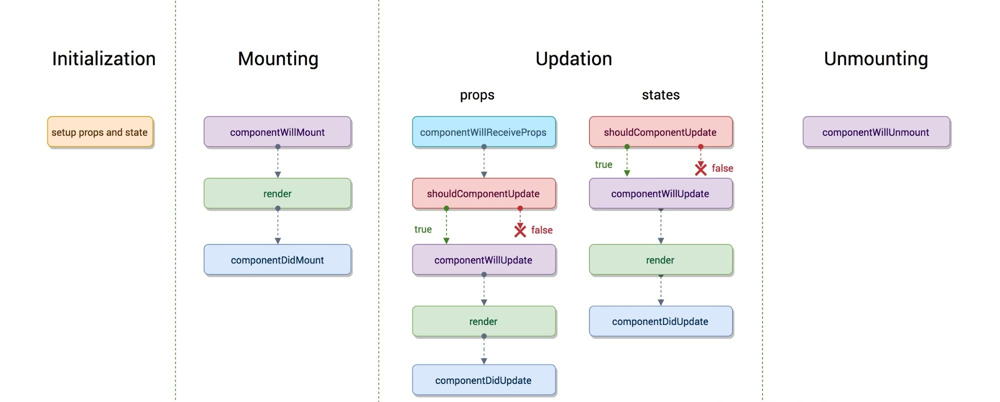

<!--
 * @Author: 王首人
 * @Date: 2022-02-26 16:40:20
 * @LastEditors: 王首人
 * @LastEditTime: 2022-02-28 09:22:36
 * @FilePath: \myReact\work exp.md
 * @Description: 开发过程的经验
 * 
 * Copyright (c) 2022 by 用户/公司名, All Rights Reserved. 
-->
## 1、如何禁止html请求favicon.ico
```html
<head>
    ...
    <link rel="icon" href="data:;base64,=">
    ...
</head>
```
## 2、虚拟Dom
`<h1>标题</h1>`（JSX：JS+XML）经babel转义后变成 `React.createElement("h1", null, "标题")`，执行后返回一个虚拟Dom对象
```js
虚拟Dom的例子
{
    type:String/FunctionComponent/ClassComponent
    props:{
        style:{...},
        onClick:Function,
        children:String/Number/[String/vDom...]/vDom,
        ...
    }
}
```
## 3、关于类组件的setState更新
react更新在事件函数、生命周期函数里都是批量的（会在函数执行完成之后批量更新），除此之外比如像setTimeout等原生的异步函数中都是同步更新的
 >事件函数里的批量更新原理：react并没有将类组件里的事件函数直接绑定给对应的dom对象，而是保存该事件函数，并在事件发生的时候将其委托给document。每个Component对象本身会有个更新器用来更新组件，在document事件函数中，会根据event.target找到保存在dom里的事件函数，在执行dom的事件函数前，会将更新器中的一个是否批量更新标志位置为true，执行后会将其置为false，并调用更新器的更新函数去更新

## 4、类组件的生命周期
