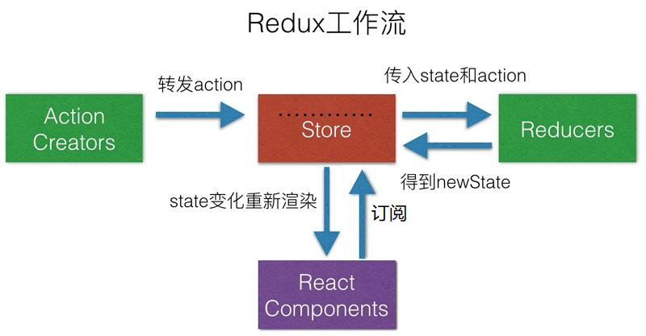

## 如何禁止 html 请求 favicon.ico

```html
<head>
  ...
  <link rel="icon" href="data:;base64,=" />
  ...
</head>
```

## 虚拟 Dom的概念

`<h1>标题</h1>`（JSX：JS+XML）经 babel 转义后变成 `React.createElement("h1", null, "标题")`，执行后返回一个虚拟 Dom 对象

```js
虚拟Dom的例子
{
    type:String/FunctionComponent/ClassComponent
    props:{
        style:{...},
        onClick:Function,
        children:String/Number/[String/vDom...]/vDom,
        ...
    }
}
```

## 关于类组件的 setState 更新

react 更新在事件函数、生命周期函数里都是批量的（会在函数执行完成之后批量更新），除此之外比如像 setTimeout 等原生的异步函数中都是同步更新的

> 事件函数里的批量更新原理(react15)：react 并没有将类组件里的事件函数直接绑定给对应的 dom 对象，而是保存该事件函数，并在事件发生的时候将其委托给`document`。每个 Component 对象本身会有个更新器用来更新组件，在 document 事件函数中，会根据 event.target 找到保存在 dom 里的事件函数，在执行 dom 的事件函数前，会将更新器中的一个是否批量更新标志位置为 true，执行后会将其置为 false，并调用更新器的更新函数去更新

## 类组件的生命周期

旧版

新版

1. 增加[static getDerivedStateFromProps(nextProps,preState)](https://zh-hans.reactjs.org/docs/react-component.html#static-getderivedstatefromprops)为了取代`componentWillReceiveProps`， `react`引入`fiber`以后组件挂载`Dom`有可能是分片的，因此这个方法有可能多次执行，同时也为了避免在后者中调用`setState`会造成死循环；返回的对象作为新的状态对象（返回 null 不会改变），与`componentWillReceiveProps`不同的是：

- 组件在挂载之前会执行一次`getDerivedStateFromProps`
- 状态改变之前也会执行

2. 增加[getSnapshotBeforeUpdate(prevProps, prevState)](https://zh-hans.reactjs.org/docs/react-component.html#getsnapshotbeforeupdate)，此生命周期方法的任何返回值将作为参数传递给 `componentDidUpdate(prevProps, prevState, snapshot)`
   

## React 是怎么区分函数组件和类组件的

类组件的父类 Component 的原型上有一个属性 `isReactComponent = {}`

## React 性能优化

### [PureComponent](https://zh-hans.reactjs.org/docs/react-api.html#reactpurecomponent)

React.PureComponent 中以浅层对比 `prop` 和 `state` 的方式来实现了`shouldComponentUpdate()`

```js
class Component extends PureComponent{
    ...
}
```

### [React.memo(functionComponent, areEqual = shallowEqual)](https://zh-hans.reactjs.org/docs/react-api.html?#reactpurecomponent)

浅比较 `props` 的变更，如果`areEqual`执行完为`true`则不刷新渲染

## fiber

`fiber`是一个执行单元，可以将一个大的任务分为一个个小任务（`fiber`），这样做的好处是，这个大任务可以被中断，在出现`fiber`以前：整个`Dom diff`的过程是一个深度优先且不可中断的过程，如果节点深度很深，那么可能会造成浏览器卡顿。`react`只是将这些寻找变更（后面会说到的`render`阶段，会进行`Dom diff`）的过程分片化（可中断），然而在真正更新到浏览器（`commit`阶段）的时候是一整个的一次性更新完（不可中断），没有进行分片化

`fiber`也可指一种数据结构，每一个`虚拟Dom`可以表示为一个`fiber`，每个`fiber`包括了`child`（子）、`sibling`（兄）、`return`（父）等属性

### 关于浏览器GUI渲染线程

这个`GUI`渲染线程大概是`16ms`渲染一次（`1`帧），也就是说`1s`内渲染`60`次，也就是`60`帧

每帧会执行：事件、定时器、`requestAnimationFrame`（在渲染动画前执行的函数）、布局、绘制这些任务

在执行完这些任务以后可能还有剩余事件，使用 `requestIdleCallback` 可以订阅一个在剩余事件要执行的任务

### 关于 requestIdleCallback 函数以及他的回调

[requestIdleCallback](https://developer.mozilla.org/zh-CN/search?q=+requestIdleCallback+) 接收一个`callback`，和一个`options`；这个`callback`接收[IdleDeadline](https://developer.mozilla.org/zh-CN/docs/Web/API/IdleDeadline)参数

- `options.timeout` 这个参数的作用是，如果现在离调用`requestIdleCallback`之间的时间超过了这个`timeout`，那么会强制执行`callback`

- `callback` 空闲时间要执行的函数，而且在超时的时候会强制执行

- `IdleDeadline` 
  - `IdleDeadline.didTimeout` 表示是否已经超时（过了`timeout`了）了       
  
  - `IdleDeadline.timeRemaining()` 表示空闲时间还有多少毫秒

### 更新节点的两个阶段

#### 1 render阶段

这个阶段首先是遍历`虚拟Dom`从而构建成一个`fiber tree`，遍历流程是一个`后序遍历`，大儿子->小儿子->父亲

如果当前节点（`currentFiber`）没有儿子，或者已经完成他的儿子们的**构建**的时候，表示这个节点**构建**完成，这个时候会找出此`currentFiber`下的所有`effects`（副作用），并将她们归并到父节点（`returnFiber`）上
- `returnFiber.firstEffect` 指向第一个有副作用的子`fiber`

- `returnFiber.lastEffect` 指向最后一个有副作用的子`fiber`

- 用 `fiber.nextEffect` 连接这些副作用

如果`currentFiber`有副作用，则会将其加入到`returnFiber`的`effect`链表中，并将`returnFiber.lastEffect`指向他：

```js
returnFiber.lastEffect.nextEffect = currentFiber
returnFiber.lastEffect = currentFiber
```

这样一直从下往上归并到`root`从而形成一个`effect list`（要更新的`fiber`链表）

#### 2 commit阶段

这个阶段将`effect list`遍历一个一个更新，不能中断，否则会出现`UI`更新不连续

## Dom-diff

1. dom diff 只比较同一个 html 元素层级下的由虚拟 Dom 组成的 children，首先遍历老的 children 构建一个 map，里面存放 key 和对应的虚拟 dom
2. 遍历生成补丁阶段
   1. 初始化一个补丁包数组和 lastPlacedIndex = 0，其中补丁包用来存放要执行移动操作或者插入操作的补丁
   2. 遍历新的 children，拿到其中每一个新的虚拟 Dom 中的 key 在 map 中查找，分两种情况：
      - 找到了的话就对两个虚拟 Dom 做比较，如果他们类型一样就可以复用，如果类型不同就做替换，然后会判断位置是否需要移动，具体操作是：会比较老的虚拟 Dom 的索引和 lastPlacedIndex，如果索引小于 lastPlacedIndex，则需要添加一个移动操作补丁（存放新老虚拟 Dom 和新的位置），如果索引大于或等于 lastPlacedIndex，则不需要移动，并将 lastPlacedIndex 置为该索引值，不管他是否移动最后都会在 map 中删掉这个 key
      - 没有找到话则说明需要添加一个插入操补丁(里面存放有新的虚拟 Dom 和插入位置)
3. 删除 dom 元素阶段
   - 根据补丁包数组遍历获得要移动的虚拟 Dom，删除这些对应的真实 Dom
   - 删除 map 里剩下的虚拟 Dom 对应的真实 Dom，因为 key 相同的虚拟 Dom 都在 map 中被移除了，剩下的都是 key 不同的元素
4. 遍历补丁数组，获得每个补丁，根据补丁类型执行对应的补丁操作，如果是移动补丁就将`dom`移位，如果是插入补丁就创建一个`dom`元素插入到父节点中

## hooks介绍

- 原理：`react`会维持一个链表，里面的每个节点保存有一个`hook`的数据对象，而在每个`hook`函数中，通过闭包保存当前的节点，每个`hook函数`在第一次调用时内部都会初始化一个节点，加入到这个链表（这也就是为什么不能在`if`这些条件判断下使用`hooks`，这样会导致链表顺序错乱），这个节点里面保存有`初始化数据`，之后再调用同样一个`hook`时会取出当前节点的数据
- `useEffect`和`useLayoutEffect`区别：`useLayoutEffect`是在绘制前执行，`useEffect`是在绘制后执行
- `hooks与classComponent比较`：类组件复用逻辑是使用`高阶组件`实现的，而使用自定义`hooks`复用逻辑使得代码逻辑更加颗粒化

## react-router

- 浏览器路由和哈希路由：`react-router`可以使用浏览器路由和哈希路由，浏览器路由里的是根据`url上的哈希值`来匹配路由，哈希路由是根据`url上的path`来匹配路由；浏览器路由里的`history`对象是使用了`html`原生的`window.history`对象来封装的，可以在浏览器历史当中保存`state`对象，哈西路由里的`history`对象是模拟实现的，`state`对象都保存在一个数组当中
- `Router`组件内部原理是使用`react上下文context`来`控制`路由数据，并监听路径变化，一旦路径变化就改变上下文，刷新渲染
- 将`匹配规则`和要渲染的`组件`或`render方法`通过`props`传递给`Route`组件，它会获取上下文，然后根据`props`里的数据来判断要不要渲染
- `Switch`组件（在 5 版本以后被替换为了`Routes`）会将他的`children`也就是`route`组件的数组进行遍历，将`route`的`匹配规则`和上下文中的`url path`路径进行匹配，只要匹配到了一个`route`，就会渲染它，剩下的都跳过，类似`switch case`
- `Prompt`组件怎么生效的？在`history`对象中的`push`方法在跳转之前会检查闭包里的`message`值，如果`message`是空串就跳转，否则弹出`message`提示用户，如果用户确认就跳转并将`message`赋值为空。而`Prompt`组件是通过`props.when`属性来判断是否要调用`history.block`，如果其`when`的值为`true`就将组件的`props.message`作为参数传入`block`，而`block`函数中会修改闭包里的`message`值

- `history`对象
  

新版变化：
` useNavigate`取代了原先版本中的`useHistory`

## Redux 的基本概念

`redux`是一个跨组件数据储存库，不仅适用于`react`

### Redux 设计思想

- 发布订阅模式
  

### 为什么使用 redux？

- 解决`react` 中兄弟组件通信的问题
- 保护数据：`redux`的状态是只读的，只能通过`dispatch`派发`action`来修改
- 扩展中间件：`redux`还可以使用中间件

### Redux 简单使用模板

`store.js`

```js
import { createStore } from "redux";
const initState = {
  //...
};
const reducer = (state, action) => {
  switch (
    action.type
    //...
  ) {
  }
  return newState;
};
const store = createStore(reducer, initialState);
export default store;
```

`something.js`

```js
import store from "./store.js";
//...
store.getStore();
//...
store.subscribe(something); //订阅 会返回一个取消订阅函数
//...
store.dispatch({ type: "some type" }); ///发布
```

### 如何使用初始状态？

- `createStore(reducer,initialState)`
- `reducer(state = initialState, action)`

### createStore 简单实现

```js
const createStore = (reducer, initialState) => {
  let state = initialState;
  let listeners = [];
  function getState() {
    return state;
  }
  function dispatch(action) {
    state = reducer(state, action);
    listeners.forEach((l) => l());
    return action;
  }
  function subscribe(listener) {
    listeners.push(listener);
    return () => {
      listeners = listeners.filter((l) => l !== listener);
    };
  }
  dispatch({ type: "@@REDUX/INIT" }); //保证有初始值
  return {
    getState,
    dispatch,
    subscribe,
  };
};
```

### 使用 bindActionCreators 绑定 store 和 action

`bindActionCreators(actionsCreators, store.dispatch)`返回一个对象，执行对象里的函数可以直接派发`action`，
也即将`store.dispatch(actionCreator())`写法 转变为 `boundActionCreators.actionCreator()`

```js
import { bindActionCreators } from "redux";
import store from "./store.js";
//actionCreator
function add() {
  return { type: "ADD" };
}
//actionCreator
function minus() {
  return { type: "MINUS" };
}
const actionCreators = { add, minus };
const boundActionCreators = bindActionCreators(actionCreators, store.dispatch);
//以后派发action可以直接使用boundActionCreators.add()或boundActionCreators.minus()
```

### 使用 combineReducers 合并 reducer

`combineReducers({reducer1,reducer2})`可以合并多个`reducer`返回一个总的`reducer`，并且会合成一个总的`state`

所有`reducer`会共享一个`action`，如果`reducer1`和`reducer2`内部处理了相同的`action`，那么合成的`reducer`中，也会进行多次处理

`reducer/index.js`

```js
import { combineReducers } from "redux";
let rootReducer = combineReducers({
  reducer1,
  reducer2,
});
/*会合成一个总的state：
{
    reducer1:{...},
    reducer2:{...}
}
*/
export default rootReducer;
```

#### combineReducers 的简单实现

```js
function combineReducers(reducers) {
  return function combinedReducer(state = {}, action) {
    let nextState = {};
    for (let key in reducers) {
      //key=x
      nextState[key] = reducers[key](state[key], action);
    }
    return nextState;
  };
}
export default combineReducers;
```

### Redux 中间件

中间件的核心：在`dispatch`执行前后执行一段代码逻辑，重写`dispatch`方法

#### 如何使用和定义中间件

```js
import { createStore, applyMiddleware } from "../redux";
function logger(
  {
    getState,
    dispatch,
  } /*MiddlewareAPI,这个dispatch是已经经过级联后的dispatch*/
) {
  return function (next) {
    //为了实现中间件的级联，调用下一个中间件
    return function (action) {
      console.log("prev state", getState());
      next(action); //如果只有一个中间件的话，next就是原始的store.dispatch
      console.log("next state", getState());
      return action;
    };
  };
}
let store = applyMiddleware(logger)(createStore)(reducer);
```

#### 中间件的原理

中间件为什么要写成这样复杂的高阶函数的样子（`柯里化`）？
因为为了让`applyMiddleware`方便`compose`调用，在`compose`传递函数参数过程中，是将上一个函数的返回值（`1`个）传入下一个函数中，所以要进行函数的柯里化

和`KOA`的中间件原理`洋葱模型`差不多
`applyMiddleware(promiseMiddleware,thunkMiddleware,loggerMiddleware)(createStore)(reducer)`执行示意图：


```js
//这里去掉了applyMiddleware的柯里化，方便理解
function applyMiddleware(createStore, reducer, ...middleares) {
  let store = createStore(reducer),
    newDispatch,
    MiddlewareAPI = {
      ...store,
      dispatch: () => newDispatch(),
    };
  let chain = middleares.map((m) => m(MiddlewareAPI));
  newDispatch = compose(...chain)(store.dispatch);
  store.dispatch = newDispatch;
  return store;
}
```

## react-redux的使用方法和部分原理

### react-redux 使用方法

#### 1. 使用 connect 连接组件

- 用`Provider`传递数据
- 用`connect`实现属性代理

`src/index.js`

```jsx
import React from "react";
import ReactDOM from "react-dom";
import RootComponent from "./components/RootComponent";
import store from "./store";
import { Provider } from "react-redux";
ReactDOM.render(
  <Provider store={store}>
    {/*通过上下文传递数据*/}
    <RootComponent />
  </Provider>,
  document.getElementById("root")
);
```

`src/components/RootComponent.js`

```jsx
import React, { Component } from "react";
import actionCreators from "../store/actionCreators/rootComponent";
import { connect } from "react-redux";
class RootComponent extends Component {
  render() {
    let { number, actionCreator1, actionCreator2 } = this.props;
    return <div>RootComponent</div>;
  }
}
let mapStateToProps = (state) => state.rootComponent;
export default connect(mapStateToProps, actionCreators)(RootComponent);
```

为什么不是`connect(mapStateToProps, actionCreators,RootComponent)`?因为`mapStateToProps`, `actionCreators`，可传可不传，参数不固定，这里做了一个`柯里化`

#### 2. 使用 hooks 连接组件

`src/index.js`

```jsx
import React from "react";
import ReactDOM from "react-dom";
import RootComponent from "./components/RootComponent";
import store from "./store";
import { Provider } from "react-redux";
ReactDOM.render(
  <Provider store={store}>
    {/*通过上下文传递数据*/}
    <RootComponent />
  </Provider>,
  document.getElementById("root")
);
```

`src/components/RootComponent.js`

```js
import React from "react";
import { useDispatch, useSelector } from "react-redux";
function RootComponent() {
  let state = useSelector((state) => state.counter1);
  let dispatch = useDispatch();
  return (
    <div>
      <p>{state.number}</p>
      <button onClick={() => dispatch({ type: "add" })}>+</button>
    </div>
  );
}
export default RootComponent;
```

### react-redux 原理

- `Provider`组件通过`context`传递`store`数据
- `connect`方法返回一个函数，将这个函数传入一个组件后执行会返回一个新组件，这个新组件获取`context`中的`store`，来订阅`state`变化并将`actionCreator`和`store`绑定并返回一个`dispatch`对象，最后将`store`和`dispatch`中的数据传给原来组件
- `useDispatch`内部使用`react.useContext`获得`store`，然后返回`store.dispatch`
- `useSelector`内部使用`react.useContext`获得`store`，然后将`store.state`传给`selector`执行，作为返回值，内部会订阅组件进行刷新

```js
function useSelector(selector, equalityFn = shallowEqual) {
  const { store } = useContext(ReactReduxContext);
  let lastSelectedState = useRef(null); //返回的对象在组件的整个生命周期内持续存在，也即都是同一个对象

  let state = store.getState();
  let selectedState = selector(state); //映射出最新的状态
  let [, dispatch] = useReducer((x) => x + 1, 0);
  useLayoutEffect(
    () =>
      store.subscribe(() => {
        //比较老状态和新选中状态是否相等，如果相等，不刷新
        let selectedState = selector(store.getState());
        if (!equalityFn(lastSelectedState.current, selectedState)) {
          console.log("重新渲染");
          dispatch();
          lastSelectedState.current = selectedState;
        }
      }),
    []
  );
  //如何获取 最新的状态值  定义useEffect,然后给lastSelectedState.current赋值，可以在任何地方通过lastSelectedState.current取到新的值
  return selectedState;
}
```

### 实现一个 useBoundDispatch 自定义 hook

为了实现以下功能

```js
function Counter() {
  let boundActionCreators = useBoundDispatch(actionCreators);
  return (
    <div>
      <button onClick={boundActionCreators.add}>+</button>
      <button onClick={boundActionCreators.minus}>-</button>
    </div>
  );
}
```

代码实现

```js
function useBoundDispatch(actions) {
  const { store } = React.useContext(ReactReduxContext);
  let boundActions = bindActionCreators(actions, store.dispatch);
  return boundActions;
}
```

## 使用 connected-react-router 将 react-redux 和 react-router 连接

[connected-react-router](https://www.npmjs.com/package/connected-react-router)

`ConnectedRouter`负责监听并向仓库派发`action`

```js
ReactDOM.render(
  <Provider store={store}>
    <ConnectedRouter history={history}>
      <>
        <Link to="/">Home</Link>
        <Link to="/counter">Counter</Link>
        <Route exact={true} path="/" component={Home} />
        <Route path="/counter" component={Counter} />
      </>
    </ConnectedRouter>
  </Provider>,
  document.getElementById("root")
);
```

`connectRouter(history)`可以生成一个保存最新路由信息的`reducer`

```js
import { combineReducers } from "redux";
import counter from "./counter";
import history from "../../history";
import { connectRouter } from "../../connected-react-router";
let reducers = {
  router: connectRouter(history),
  counter,
};
let rootReducer = combineReducers(reducers);
export default rootReducer;
```

`routerMiddleware `是一个中间件，可以通过这个中间件进行路由跳转

```js
//store.js
let store = applyMiddleware(routerMiddleware(history))(createStore)(
  rootReducer
);

//action.js
import { push } from "connected-react-router";
export default {
  goto(path: string, state?: any) {
    return push(path, state);
  },
};
```

## ReactNode 和 ReactElement 的区别

- `ReactNode`是指`react`能够渲染的值，他包括`null|number|string|ReactElement`

- `ReactElement`是指`虚拟Dom`

## 虚拟 Dom 的优缺点

优点

- 跨平台
- 防止 xss 攻击（内部做了过滤）
- 处理兼容
- 差异化更新 Dom

缺点

- 占内存
- 首次渲染可能比较慢

## 函数组件和类组件对比

相同点

- 接收属性并且返回 React 元素

不同点

- 面向对象和函数式编程

- 类组件需要创建并保存实例，函数组件不需要创建实例，可以节约内存占用

- 逻辑复用：类组件通过`extends`或者`HOC`来实现，函数组件通过`自定义hooks`和`HOC`来实现

- 类组件在通过`Babel`转成`es5`的时候代码会更多

## 什么是自定义 hooks

`use`开头，里面调用了其他`hooks`

为什么要返回数组呢？为了以后方便扩展

## React 设计模式

### 工厂模式

如`react.createElement`

### 策略模式

如虚拟`Dom`中的`$$typeof`属性

### 发布订阅模式

如合成事件、`class`组件中的更新器

### 提供者模式

如`context`

### 组合模式

如`react-redux`中的`connect`，如`Form`、`FormItem`

### 属性代理

如`HOC`包裹组件


