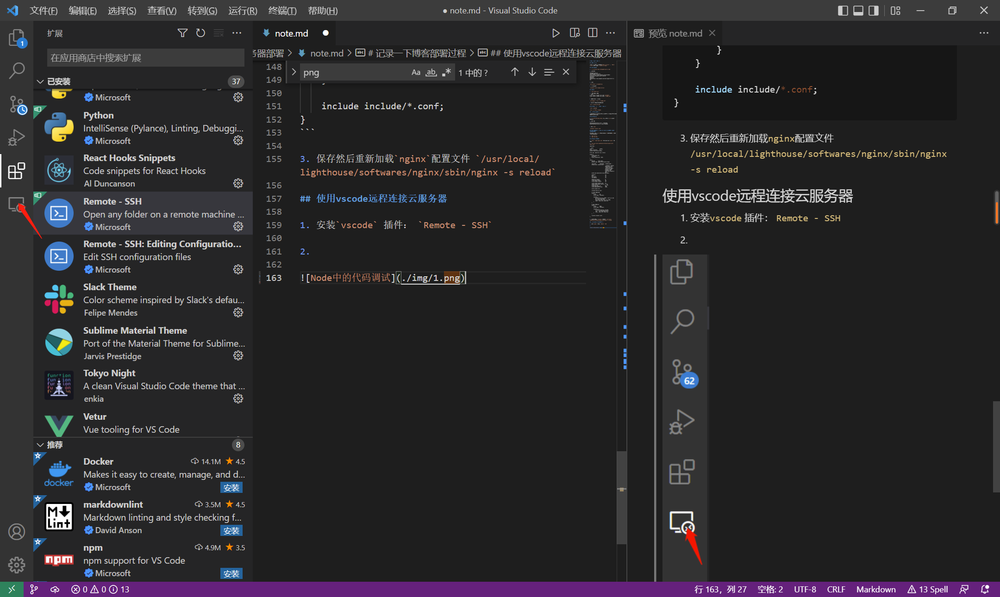
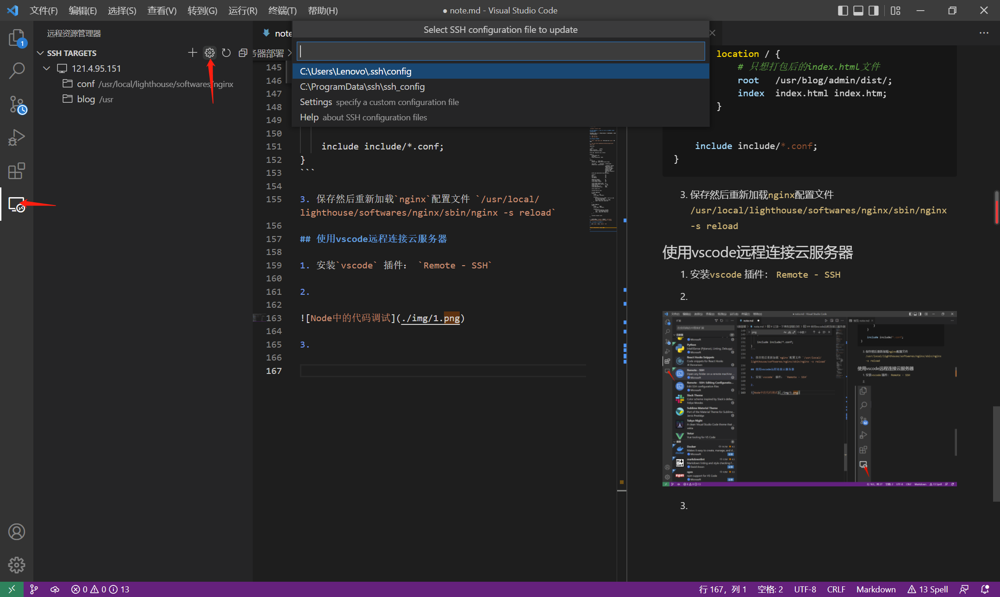

# 记录一下博客部署过程

## 云服务器环境

用的是腾讯云服务器，预装了`Node.js 14.16.1` 和 `Nginx 1.18.0`，操作系统是 `CentOS 8.2 64bit`

## 安装 Mongodb

1. `vi /etc/yum.repos.d/mongodb-org-4.4.repo`

2. 粘贴内容:
```
[mongodb-org-4.4]
name=MongoDB Repository
baseurl=https://repo.mongodb.org/yum/redhat/$releasever/mongodb-org/4.4/x86_64/
gpgcheck=1
enabled=1
gpgkey=https://www.mongodb.org/static/pgp/server-4.4.asc
```

3. 安装:

`yum install -y mongodb-org`

4. 启动mongodb

`systemctl start mongod.service`

## 安装Git

1. `yum install git `

2. 配置用户名和邮箱
```bash
$ git config --global user.name "userName"
$ git config --global user.email "xxx@qq.com"
```

3. 生成公钥（一路回车）

`ssh-keygen -t rsa -C "xxx@qq.com"`

4. 将公钥配置到GitHub账户上面

`cat ~/.ssh/id_rsa.pub`

## 查看端口占用和杀死端口占用的进程

`lsof -i:端口号`

`kill -s 9 某个进程的PID`

## 使用密钥登录服务器

在管理平台创建好密钥对，然后进入云服务器实例绑定密钥，下次就可以用私钥登录了

## 禁用密码登录

1. `vi /etc/ssh/sshd_config` （感觉这个是`ssh`登录的配置文件）

2. 更改配置
```
PubkeyAuthentication yes #开启密钥认证
PasswordAuthentication no #禁用密码认证
```

3. 重启`sshd`

`systemctl restart sshd`

## 解决在Egg项目中使用npm run start启动后端服务器失败（页面报500）

这个问题是后端使用`ts`写的，没有将`ts`文件编译成`js`文件导致，解决方案：

1. `npm run tsc`
2. `npm run start`

## 修改nginx配置文件

1. `find / -name nginx.conf	`这个命令是查找`nginx`配置文件

2. `vim /usr/local/lighthouse/softwares/nginx/conf/nginx.conf`

我的配置是:

```nginx
user                 nobody;
worker_processes     2;
worker_rlimit_nofile 65535;

error_log  logs/error.log  notice;

events {
    accept_mutex off;
    use epoll;
    worker_connections  8192;
}

http {
    include       mime.types;
    default_type  application/octet-stream;

    log_format       combinedio  '$remote_addr - $remote_user [$time_local] '
                                 '"$request" $status $body_bytes_sent '
                                 '"$http_referer" "$http_user_agent" $request_length $request_time $upstream_response_time';
    access_log logs/access.log combinedio;

    sendfile                     on;
    gzip                         on;
    tcp_nopush                   on;
    tcp_nodelay		         on;

    keepalive_timeout            0;
    client_body_timeout          10;
    client_header_timeout        10;

    client_header_buffer_size    1k;
    large_client_header_buffers  4  4k;
    output_buffers               2  32k;
    client_max_body_size	 64m;
    client_body_buffer_size      256k; 

    server_tokens off;

    include http.d/*.conf;

    ssl_certificate wangshouren.cool_bundle.crt;   #填写您的证书文件名称，例如：cloud.tencent.com_bundle.crt
    ssl_certificate_key wangshouren.cool.key;    #填写您的私钥文件名称，例如：cloud.tencent.com.key
 
    server {
        listen 443 ssl;
        server_tokens off;
        keepalive_timeout 5;
        server_name  localhost;
        root /usr/blog/client/out/;
        index index.php index.html;
        server_name wangshouren.cool; #填写您的证书绑定的域名，例如：www.cloud.tencent.com
        ssl_certificate wangshouren.cool_bundle.crt; #填写您的证书文件名称，例如：cloud.tencent.com_bundle.crt
        ssl_certificate_key wangshouren.cool.key; #填写您的私钥文件名称，例如：cloud.tencent.com.key
        ssl_session_timeout 5m;
        ssl_protocols TLSv1 TLSv1.1 TLSv1.2;  # 可参考此 SSL 协议进行配置
        ssl_ciphers ECDHE-RSA-AES128-GCM-SHA256:HIGH:!aNULL:!MD5:!RC4:!DHE;   #可按照此加密套件配置，写法遵循 openssl 标准
        ssl_prefer_server_ciphers on;
    }

    server {
        listen 9000 ssl;
        server_tokens off;
        keepalive_timeout 5;
        server_name  localhost;
        root /usr/blog/admin/dist/;
        index index.php index.html;
        server_name wangshouren.cool; #填写您的证书绑定的域名，例如：www.cloud.tencent.com
        ssl_certificate wangshouren.cool_bundle.crt; #填写您的证书文件名称，例如：cloud.tencent.com_bundle.crt
        ssl_certificate_key wangshouren.cool.key; #填写您的私钥文件名称，例如：cloud.tencent.com.key
        ssl_session_timeout 5m;
        ssl_protocols TLSv1 TLSv1.1 TLSv1.2;  # 可参考此 SSL 协议进行配置
        ssl_ciphers ECDHE-RSA-AES128-GCM-SHA256:HIGH:!aNULL:!MD5:!RC4:!DHE;   #可按照此加密套件配置，写法遵循 openssl 标准
        ssl_prefer_server_ciphers on;
    }

    server {
        listen 80;
        server_name wangshouren.cool;    #填写您的证书绑定的域名，例如：cloud.tencent.com
        return 301 https://$host$request_uri;       #将http的域名请求转成https
    }

    include include/*.conf;
}

```

3. 保存然后重新加载`nginx`配置文件 `/usr/local/lighthouse/softwares/nginx/sbin/nginx -s reload`

### 其他nginx命令

- 停止nginx

`pkill -9 nginx`

- 重启nginx

`systemctl reload nginx`

### 将nginx命令添加到环境变量中

`vim /etc/profile`

添加
`export PATH="$PATH:/usr/local/lighthouse/softwares/nginx/sbin/"`

`source /etc/profile`

## 使用vscode远程连接云服务器

1. 安装`vscode` 插件： `Remote - SSH`

2.  



3. 




4. 

```
Host 121.4.95.151 #名字，随便取
    HostName 121.4.95.151 #公网ip
    User root #登录用户名
	IdentityFile C:\Users\Lenovo\Downloads\miyao(1) #登录云服务器用的密钥的存放位置
```
